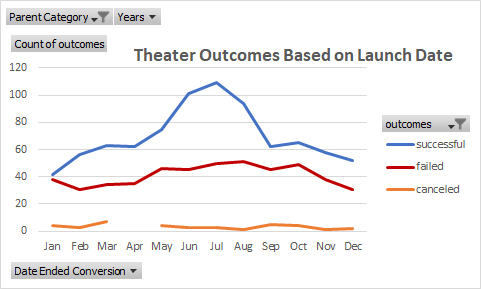
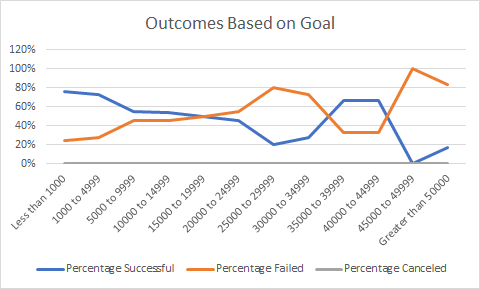

# Kickstarting with Excel

## Overview of Project

### Purpose
This project was focused on determining a Kickstarter's different theater campaigns' relationship between their respective launch dates and fundraising goals.

## Analysis and Challenges
The analysis was performed by first creating a pivot table to view the amounts of successful, failed, and canceled (referred to as "outcomes") theater campaigns per month throughout the entire duration included in the Kickstarter dataset. A line chart of "Theater Outcomes Based on Launch Date" was generated to visualize correlations between each of the outcomes as well as their peaks. Finally, another chart was generated to show "Outcomes Based on [Fundraising] Goal", to visualize any relationship between fundraising goals and the success, failure, or cancellation of any of those campaigns.

One challenge that could be expected during this analysis would be to determine if there was any relationship between the duration of the campaign as well as its outcome. Another challenge  would be using the COUNTIFS() function to determine fundraising goal ranges, since setting a range is somewhat nonintuitive with inequalities.

### Analysis of Outcomes Based on Launch Date
During the months of June, July, and August, there was a peak in successful theater campaigns. Following the summer peak, campaign success rates declined.  

### Analysis of Outcomes Based on Goals
Out of 69% of all theater campaigns held (1,042), more than 73% (528) of them were successful when their fundraising goal was below $5,000.  

### Challenges and Difficulties Encountered

## Results

- **What are two conclusions you can draw about the Outcomes based on Launch Date?**
More theater campaigns were held during the summer months, and more of them proved to be successful.

- **What can you conclude about the Outcomes based on Goals?**  
Generally speaking, there is an inverse relationship between campaign success and fundraising goal. This conclusion is drawn because, with the exception of $35,000-45,000 goals, there was a steady decrease in success rate as fundraising goals increased.

- **What are some limitations of this dataset?**  
The data set only contains data from 2009 through 2017, so there is fairly limited data. The data is also from Kickstarter, which may have not been as well known in the earlier years of the dataset.

- **What are some other possible tables and/or graphs that we could create?**  
A good table and graph to visualize would be between campaign fundraising duration and the outcome of that campaign. Since the analysis was only performed on the relationship between fundraising goal and outcome, it would be interesting to see if duration vs outcome would agree with the results from goal vs outcome. Another visualtion would be to see outcomes based on year, to see if there was any relationship between successful campaigns and the impact of Kickstarter popularity over the course of the dataset.

---
Pre-challenge work

# An Analysis of Kickstarter Campaigns
Performing analysis on Kickstarter data to uncover trends in media
---

### Outcomes vs Categories

### Outcomes vs Subcategories

### Outcomes Based on Launch Date

